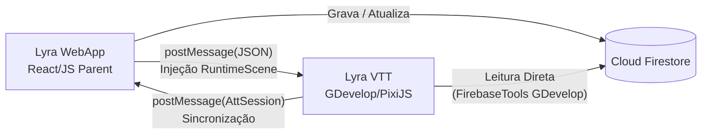

# Guia Completo de Integração: Lyra WebApp ⇄ Lyra VTT (GDevelop)

Este documento foi elaborado para alinhar a comunicação entre a aplicação **Lyra the Wise** e o motor tático **Lyra VTT (desenvolvido em GDevelop)** através do **Google Cloud Firestore**.

---

## 1. Visão Geral da Arquitetura

O ecossistema opera em três frentes sincronizadas:
1. **Lyra WebApp (Parent Window):** Responsável por autenticação de usuários, gerenciamento de campanhas, banco de fichas completas (D&D 5e) e controle de sessões.
2. **Iframe do VTT:** Executa o runtime do GDevelop compilado com PixiJS em Canvas WebGL. Comunica-se bidirecionalmente com o site pai via `window.postMessage` e injeção de variáveis de cena (`runtimeScene.getVariables()`).
3. **Cloud Firestore:** Banco de dados NoSQL compartilhado onde residem as fichas dos personagens, documentos de sessão em tempo real e lista de convites.



---

## 2. Coleções do Firestore e Modelagem de Dados

### 2.1. Coleção: `fichas` (Fichas dos Personagens / Heróis)
Caminho no Firestore: `fichas/{fichaId}`

Cada documento representa a ficha completa do aventureiro. Quando o VTT recebe um comando `LoadPlayer` com o `fichaId`, o GDevelop executa internamente:
`gdjs.evtTools.firebaseTools.firestore.getDocument("fichas", fichaId, NewChar_FireBase, NewChar_FireBase_Error)`

#### Estrutura Completa do Documento `fichas/{fichaId}`:
```json
{
  "id": "zZGB25awR8g6NlmBKwRH",
  "userId": "zOJePJfyCHXukzWzUpHjkq4WtGA2",
  "systemId": "dnd5e",
  "tokenUrl": "https://firebasestorage.googleapis.com/v0/b/lyra-the-wise.firebasestorage.app/o/tokens%2Fhero.png?alt=media",
  
  "bio": {
    "name": "Firstalion",
    "class": "Mago",
    "subclass": "Evocação",
    "level": 3,
    "race": "Alto Elfo",
    "alignment": "Caótico e Bom"
  },

  "stats": {
    "ac": 13,
    "hp": 24,
    "speed": 9
  },

  "attributes": {
    "str": 10,
    "dex": 14,
    "con": 14,
    "int": 18,
    "wis": 12,
    "cha": 10
  },

  "combat": {
    "ac": 13,
    "hp": {
      "current": 24,
      "max": 24,
      "temp": 0
    },
    "attacks": [
      {
        "name": "Adaga de Prata",
        "damage": "1d4+2 Perfurante"
      },
      {
        "name": "Bordão Arcano",
        "damage": "1d6+0 Contusão"
      }
    ]
  },

  "spells": {
    "save_dc": 14,
    "attack_bonus": 6,
    "list": [
      {
        "name": "Mísseis Mágicos",
        "range": "36m",
        "duration": "Instantânea",
        "casting_time": "1 Ação",
        "description": "Você cria três dardos brilhantes de energia mágica. Cada dardo atinge uma criatura à sua escolha causando 1d4+1 de dano de energia."
      },
      {
        "name": "Escudo Arcano",
        "range": "Pessoal",
        "duration": "1 Rodada",
        "casting_time": "1 Reação",
        "description": "Uma barreira invisível surge concedendo +5 na CA até o início do seu próximo turno e imunidade a Mísseis Mágicos."
      },
      {
        "name": "Orbe Cromática",
        "range": "27m",
        "duration": "Instantânea",
        "casting_time": "1 Ação",
        "description": "Você arremessa uma esfera de 10cm de energia cósmica causando 3d8 de dano elemental."
      }
    ]
  },

  "proficiencies_choice": {
    "skills": ["arcanismo", "historia", "investigacao", "percepcao"]
  }
}
```

> [!IMPORTANT]
> **Campos Obrigatórios para os Action Cards do GDevelop:**
> - `combat.attacks`: Cada item **precisa** conter `name` (string) e `damage` (string).
> - `spells.list`: Cada item **precisa** conter `name`, `range`, `duration`, `casting_time` e `description`.
> - `stats.speed`: Deve ser numérico (ex: `9`), pois o motor divide a velocidade pelo tamanho de grade (`CellSize`).
> - `tokenUrl`: Deve ser uma URL absoluta começando com `http` ou `https` para compatibilidade com o loader PixiJS.

---

### 2.2. Coleção: `sessoes` (Estado Tático da Sessão)
Caminho no Firestore: `sessoes/{sessionId}`

O documento da sessão mantém o estado compartilhado entre o Mestre e todos os Jogadores conectados.

#### Estrutura do Documento `sessoes/{sessionId}`:
```json
{
  "id": "F5ZR98crxP9AnsBVDvtN",
  "title": "O Segredo do Templo Perdido",
  "gmId": "BMWkVYPnTEbPPBQcayazzllaHxk1",
  "mapUrl": "https://firebasestorage.googleapis.com/.../mapa_templo.jpg",
  "cellSize": 64,

  "data": {
    "Map": {
      "Img": "https://firebasestorage.googleapis.com/.../mapa_templo.jpg",
      "CellSize": 64,
      "x": 1280,
      "y": 720
    },
    "Act_Scene_State": "FREE",
    "Att": true,
    "Time": 1788577815056,
    "Iniciative": {
      "on": false,
      "act": 0,
      "instance": 0,
      "order": []
    },
    "Players": {},
    "Tile_Matriz": []
  },

  "AttSession": {
    "Act_Scene_State": "FREE",
    "Att": true,
    "Time": 1788577815056,
    "Players": {},
    "Tile_Matriz": []
  },

  "updatedAt": "Timestamp"
}
```

> [!NOTE]
> O GDevelop consulta o campo aninhado `data` quando a ação `LoadSessionFirebase` é executada. O site Lyra também sincroniza `AttSession` e `vttVariables` para garantir compatibilidade com versões anteriores.

---

### 2.3. Coleção: `session_invites` (Participantes Conectados)
Caminho no Firestore: `session_invites/{inviteId}`

Vincula os jogadores cadastrados à sessão e informa qual herói (`characterId`) está atribuído ao jogador:
```json
{
  "sessionId": "F5ZR98crxP9AnsBVDvtN",
  "userId": "zOJePJfyCHXukzWzUpHjkq4WtGA2",
  "role": "player",
  "status": "online",
  "characterId": "zZGB25awR8g6NlmBKwRH",
  "characterName": "Firstalion",
  "avatar": "https://.../token.png"
}
```

---

## 3. Protocolo de Mensagens JSON (Site ⇄ GDevelop)

Todas as mensagens trocadas seguem o padrão canônico:
```json
{
  "type": "TIPO_DO_COMANDO",
  "content": { ... }
}
```

### 3.1. Enviados pelo Site e Recebidos pelo VTT

| Tipo | Finalidade | Exemplo de Payload |
|---|---|---|
| `PlayerID` | Informa quem está logado e se possui poderes de Mestre (`IsMaster: true/false`). | `{"PlayerID": "uid123", "IsMaster": "true"}` |
| `SessionID` | Vincula a sessão e dispara a conexão Firestore interna. | `{"SessionID": "sessao456", "LoadSession": "on"}` |
| `LoadMap` | Aplica o cenário e dimensiona a grade tática. | `{"urlMap": "https://.../map.jpg", "CellSize": 64, "CustonSize": {"on": "true", "x": "1280", "y": "720"}}` |
| `LoadPlayer` | Convoca os tokens dos aventureiros com suas fichas. | `{"nPlayers": 1, "players": [{"fichaId": "zZGB25aw...", "position": {"x": 6, "y": 5}}]}` |
| `LoadNPC` | Spawna monstros ou NPCs da coleção `user_monsters`. | `{"nNPC": 1, "NPCs": [{"fichaId": "m123", "collection": "user_monsters", "position": {"x": 10, "y": 10}}]}` |
| `AttSession` | Sincroniza matriz de colisão, posições de tokens e rodada. | `{"Act_Scene_State": "FREE", "Att": true, "Tile_Matriz": [...], "Time": 1788577815056}` |

### 3.2. Enviados pelo GDevelop e Recebidos pelo Site

| Tipo | Finalidade | Quando é disparado |
|---|---|---|
| `AttSession` | Publica alterações no tabuleiro (movimento de tokens, início de combate, grid). | Ao soltar um token ou mover peças. |
| `LogSend` | Envia registros de rolagem de dados e cartas jogadas para o chat da Lyra. | Ao rolar dados ou acionar um card de magia/ataque. |
| `Iniciative` | Atualiza o rastreador de turnos e ordem de iniciativa. | Ao rolar iniciativa na cena. |
| `UpDateSession` | Solicita atualização pontual de campos no documento da sessão. | Ao alterar estado de combate. |

---

## 4. Regras de Permissão do Firestore (`firestore.rules`)

Como o motor GDevelop roda desautenticado dentro de um `<iframe>`, as regras foram configuradas para permitir leitura das coleções de suporte tático:

```javascript
rules_version = '2';
service cloud.firestore {
  match /databases/{database}/documents {
    
    // Fichas de Personagem: Leitura pública para o VTT carregar magias, stats e tokens
    match /fichas/{fichaId} {
      allow read: if true;
      allow write: if request.auth != null;
    }

    // Sessões de Jogo: Leitura pública para o motor sincronizar mapas e matriz de peças
    match /sessoes/{sessionId} {
      allow read: if true;
      allow write: if request.auth != null;
    }

    // Convites e Participantes: Leitura liberada para montar a lista de heróis
    match /session_invites/{inviteId} {
      allow read: if true;
      allow write: if request.auth != null;
    }
  }
}
```

---

## 5. Como Testar e Validar Diretamente no GDevelop

1. **Testar Busca da Ficha:**
   - No GDevelop, crie uma ação `FirebaseTools::GetDocument("fichas", "zZGB25awR8g6NlmBKwRH", VariavelCena, VariavelErro)`.
   - Inspecione a variável e confirme que `VariavelCena.combat.attacks` e `VariavelCena.spells.list` contêm arrays com os objetos formatados.
2. **Testar Action Cards:**
   - Ao selecionar o token com o mouse, a cena deve invocar o layout externo `ActionCard` para cada ataque e cada magia contida em `Players[Select_Player]`.
3. **Rolagem de Dados 3D:**
   - Ao clicar em um card gerado, o evento deve instanciar o layout externo `RollDice` enviando o `LogSend` com a fórmula correspondente (ex: `1d20+6` para acerto ou `3d8` para dano).
