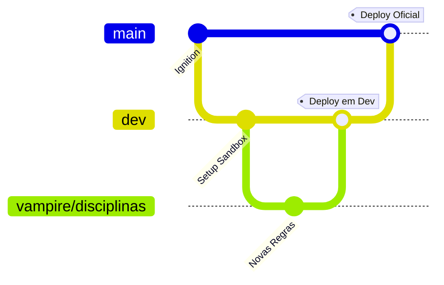

# 🔮 Fluxo Colaborativo & Emulação Local — Lyra the Wise WebApp

Este tomo místico documenta o fluxo de trabalho colaborativo, controle de branches no Git e configuração de emulação local do Firebase para o desenvolvimento seguro do **Lyra the Wise WebApp**.

---

## 🗺️ 1. Arquitetura de Branches (Git Flow & Multi-Ambiente)

Para garantir que o código em produção esteja sempre estável e harmonizado, dividimos o multiverso do projeto em branches dedicadas integradas à nossa infraestrutura Firebase App Hosting:



* **`main` (Produção Oficial):** Reflete o código sagrado e estável rodando na mesa oficial (`lyrathewise.lat`). **NUNCA programe diretamente na main.** Merges aqui são exclusivos do Dono do Projeto após validação.
* **`dev` (Integração & Homologação):** Branch unificada de testes. Qualquer commit ou merge nesta branch dispara automaticamente o deploy no Firebase App Hosting de desenvolvimento (`lyra-the-wise-dev`).
* **Branches Temáticas de Desenvolvimento:**
    *   **Funcionalidades de sistemas existentes (`sistema/feature`):** Ramificações criadas a partir de `dev` para implementar regras específicas de um motor de RPG existente.
        *   *Exemplos:* `vampire/disciplinas`, `dnd5e/ficha-viajante`, `vampire/ajuste-tokens`
    *   **Novos sistemas criados do zero (`nome_sistema`):** Ramificações dedicadas a plugins ou RPGs novos construídos inteiramente do zero.
        *   *Exemplos:* `tormenta20`, `cyberpunk`, `call_of_cthulhu`

### Comandos Úteis do Viajante:
```bash
# 1. Sincronizar o repositório local com as branches oficiais
git checkout dev
git pull origin dev

# 2. Criar uma nova branch de funcionalidade para sistema existente
git checkout -b vampire/nome-da-sua-funcionalidade

# 3. Criar uma nova branch para um sistema totalmente novo do zero
git checkout -b tormenta20
```


---

## ⚡ 2. Playground Local (Firebase Emulator Suite)

Para que todos trabalhem de forma independente nas branches de desenvolvimento **sem tocar no Firebase de Produção (nuvem)**, utilizamos o **Emulator Suite**. Ele replica o banco de dados (Firestore), a autenticação (Auth) e o armazenamento (Storage) localmente na sua máquina de forma rápida, isolada e 100% offline.

> [!CAUTION]
> **ATENÇÃO ÀS PORTAS DE COMUNICAÇÃO:**
> O servidor do frontend do Vite (rodado pelo `npm run dev-total`) utiliza a porta **`5173`**. 
> Se você tentar rodar algum emulador do Firebase (como o de Auth) na porta `5173`, haverá colisão e um dos dois serviços falhará em iniciar!
> Configuramos o arquivo `firebase.json` com portas limpas e consagradas para evitar conflitos.

### 🔌 Tabela de Portas do Multiverso Local:

| Serviço / Motor | Porta Local | Descrição |
| :--- | :---: | :--- |
| **Vite Frontend (SPA)** | `5173` | Onde você acessa a aplicação web (Vite dev server) |
| **Express Backend** | `8080` / `8082` | Servidor Node local que gerencia APIs secundárias |
| **Firebase Auth Emulator** | `9099` | Emulador de Contas e Login local (Offline) |
| **Firebase Firestore Emulator**| `8080` | Emulador do Banco de Dados local |
| **Firebase Storage Emulator** | `9199` | Emulador de Upload de Imagens/Tokens local |
| **Firebase Emulator Suite UI** | `4000` | **Painel Web de Controle** do Banco e Usuários locais |

---

## 🚀 3. Como Rodar o Playground Completo

Siga estes ritos de inicialização para programar localmente:

### Passo 1: Ligar os Emuladores do Firebase
No seu terminal do VS Code, inicie a emulação local offline:
```bash
firebase emulators:start
```
> [!TIP]
> Abra o navegador em `http://localhost:4000` para acessar o **Emulator Suite UI**. Lá você poderá criar contas de testes na aba *Authentication* e gerenciar os documentos e fichas livremente na aba *Firestore*, exatamente como no painel da nuvem!

### Passo 2: Ligar o Servidor de Desenvolvimento
Em outro terminal (deixe o emulador rodando no anterior), suba o front-end e o servidor NodeJS do app:
```bash
npm run dev-total
```
Acesse a aplicação em `http://localhost:5173`. 

---

## 🛡️ 4. Regras de Ouro da Governança

> [!IMPORTANT]
> **1. Conexão Automática de Emulação:**
> A aplicação em `js/auth.js` detecta automaticamente se você está em `localhost` e redireciona todas as chamadas do Firestore e do Auth para as portas do emulador local. Nenhum dado de teste ou credencial vazará para o Firebase real da nuvem.
>
> **2. Commits Limpos:**
> Nunca commite arquivos `.env` privados com chaves reais da nuvem. Use o `.env.example` como base.
> 
> **3. Evite Deploys Diretos:**
> O comando `firebase deploy` destina-se **exclusivamente** à branch `main` após homologação de PRs (Pull Requests). Nunca faça deploy a partir de branches de testes.

---

## 🔮 5. Criação de Novos Sistemas de RPG (Plugins Arcanos)

O motor do **Lyra the Wise** é modular e extensível. Para criar um novo sistema de RPG (como *Tormenta20*, *Call of Cthulhu* ou *Fate*), você deve criar um plugin JavaScript e registrá-lo no `SystemRegistry`.

### 📂 Estrutura de Arquivos:
1. Crie o arquivo do seu sistema em: `js/systems/seu-sistema.js`
2. Importe-o no portal de auditoria (`js/modules/diagnose.js`) e no núcleo do app (`js/app.js`) para que ele seja carregado em tempo de execução.

### 📐 Rito de Implementação (Scaffold Base):
O seu plugin deve exportar um objeto com métodos e configurações específicas. Ele deve herdar da interface base e registrar-se ao final do arquivo. Veja o exemplo de scaffold mínimo estruturado:

```javascript
import SystemRegistry from './system-registry.js';
import { escapeHTML } from '../modules/utils.js';

export const SeuNovoSistemaPlugin = {
    id: 'seu-sistema-id', // ID único em minúsculo
    name: 'Nome do Seu RPG',
    implemented: true,
    version: '1.0.0',
    icon: 'fa-dice-d20', // Ícone do FontAwesome

    // 1. DADOS E TEMPLATES
    getTemplate() {
        return {
            bio: { name: "", class: "", level: 1, alignment: "" },
            attributes: { strength: 10, dexterity: 10 },
            stats: { hp_max: 10, hp_current: 10, ac: 10 },
            proficiencies_choice: { skills: [] }
        };
    },

    getCreationData() {
        return {
            races: ["Humano", "Elfo"],
            classes: ["Guerreiro", "Mago"],
            alignments: ["Ordeiro", "Caótico"],
            backgrounds: ["Ermitão", "Nobre"]
        };
    },

    // 2. CONFIGURAÇÕES DE ATRIBUTOS E PERÍCIAS
    getAttributeConfig() {
        return [
            { id: 'strength', label: 'Força', shortLabel: 'FOR', description: 'Poder físico' },
            { id: 'dexterity', label: 'Destreza', shortLabel: 'DES', description: 'Agilidade' }
        ];
    },

    getSkillConfig() {
        return [
            { id: 'atletismo', label: 'Atletismo', attribute: 'strength', description: 'Saltos e corrida' }
        ];
    },

    getSaveConfig() {
        return [
            { id: 'strength', label: 'Resistência de Força', description: 'Resistir a efeitos físicos' }
        ];
    },

    // 3. MOTOR DE CÁLCULO
    calculateStats(char) {
        const stats = { attributes: {}, skills: {}, saves: {}, general: {} };
        // Faça as fórmulas de cálculo do seu sistema aqui
        stats.general.hp_max = parseInt(char.stats?.hp_max || 10);
        return stats;
    },

    // 4. RENDERS DE COMPONENTES VISUAIS (INTERFACE)
    renderSheetScores(char, systemStats, helpers) {
        return `<div>Cartões de Atributos com ${helpers.mkInput(char.attributes?.strength, 'attributes.strength')}</div>`;
    },

    renderSheetSaves(char, systemStats, helpers) {
        return `<div>Resistências</div>`;
    },

    renderSheetSkills(char, systemStats, helpers) {
        return `<div>Perícias</div>`;
    },

    renderSheetCombatTab(char, systemStats, helpers) {
        return `<div>Painel de Combate</div>`;
    },

    // 5. INTEGRAÇÃO COM PROMPTS DO ORÁCULO (IA GEMINI)
    getPromptContext() {
        return 'Contexto detalhado das regras e cenário do Seu RPG para a IA';
    },

    getEntityPrompt(entityType, prompt, flavor) {
        return `Gere um JSON para criatura no formato do Seu RPG.`;
    },

    getCharacterPrompt() {
        return `Aja como o narrador do Seu RPG e descreva o histórico e ambições do personagem.`;
    },

    // 6. REGRAS DE COMBATE
    getCombatConfig() {
        return {
            usesInitiative: true,
            initiativeAttribute: 'dexterity',
            usesDeathSaves: false,
            healthLabel: 'Pontos de Vida',
            defenseLabel: 'Defesa'
        };
    },

    calculateInitiativeBonus(char) {
        return 0; // Fórmula de bônus de iniciativa
    }
};

// Auto-registro no Orquestrador
SystemRegistry.register(SeuNovoSistemaPlugin);
```

### 🔬 Testando a Integridade (Auditoria de Sistemas):
Após criar e registrar seu plugin, abra a tela **Auditoria de Sistemas** (`diagnose.html`) e clique em **"Iniciar Auditoria"** no card do seu sistema. 
O console arcanum irá:
1. Executar testes de tipo (`dry-run`) em tempo real em todas as funções obrigatórias.
2. Validar o formato dos objetos de retorno.
3. Verificar a ativação das extensões opcionais.
Se tudo passar nos testes sem erros, seu sistema estará homologado para a mesa do mestre!

---

Que a harmonia das runas guie seu desenvolvimento! 🔮✨
