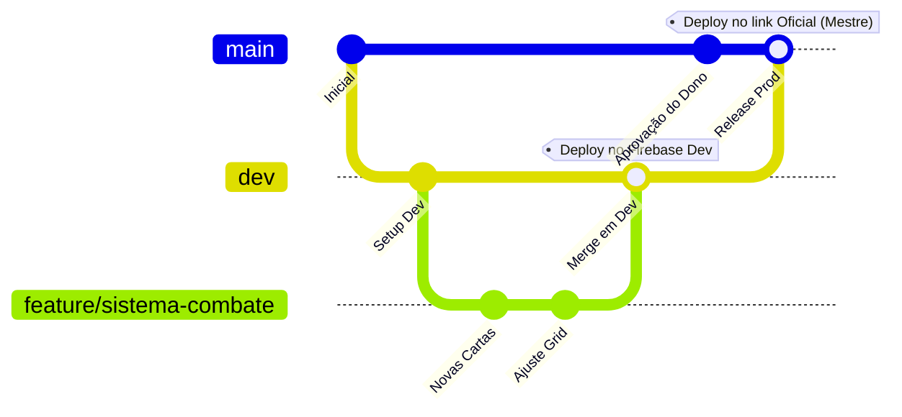

# Guia de Fluxo de Trabalho (Git & Firebase Multi-Ambiente)

Este guia descreve o fluxo de trabalho obrigatório para todos os colaboradores e desenvolvedores da crônica **Lyra the Wise**. Ele detalha como trabalhar com ramificações (branches), como realizar testes de forma isolada no ambiente de desenvolvimento do Firebase e o protocolo rigoroso de aprovação para a branch de produção (`main`).

---

## 1. Estrutura de Branches do Projeto

Nosso repositório é governado por três níveis de ramificações para garantir a segurança dos dados e estabilidade da mesa de RPG dos jogadores.



### 🟥 Branch `main` (Produção Oficial)
*   **Finalidade:** Reflete o código sagrado e estável rodando na mesa oficial dos jogadores (`lyrathewise.lat`).
*   **Regra de Ouro:** **Ninguém commita ou faz merge diretamente na `main`.**
*   **Permissão:** Apenas o **Dono do Projeto** (Mestre) pode autorizar e realizar merges nesta branch após validação completa de estabilidade.

### 🟧 Branch `dev` (Ambiente de Testes)
*   **Finalidade:** Integração de código novo para homologação e testes de mesa.
*   **Deploy Automático:** Qualquer commit ou merge nesta branch dispara automaticamente a build do Firebase App Hosting de desenvolvimento (`lyra-the-wise-dev.web.app`).
*   **Permissão:** Desenvolvedores parceiros podem fazer merge das suas respectivas branches de feature para a `dev` para liberar o link de testes aos amigos.

### 🟩 Branches de Funcionalidades (Padrão `sistema/funcionalidade`)
*   **Finalidade:** Ramificações onde as funcionalidades individuais são codificadas localmente pelos desenvolvedores de forma isolada.
*   **Nomenclatura Recomendada:** Em vez de usar prefixos genéricos (como `feature/`), agrupamos as branches logicamente pelo **ID do Sistema de RPG** em que o desenvolvedor está trabalhando.
    *   **Estrutura:** `[id-do-sistema]/[nome-da-funcionalidade]`
    *   **Exemplos Práticos:**
        *   `dnd5e/ficha-viajante`
        *   `vampire/combate-disciplinas`
        *   `vampire/ajuste-tokens`
        *   `geral/melhoria-chat-ia` (para tarefas globais que afetam todo o portal)

---

## 2. Passo a Passo do Fluxo de Desenvolvimento

### Passo 1: Iniciando uma Nova Funcionalidade
Sempre comece atualizando a sua branch `dev` local e ramificando a partir dela.

```bash
# 1. Mude para a branch de desenvolvimento
git checkout dev

# 2. Puxe as atualizações mais recentes do repositório remoto
git pull origin dev

# 3. Crie e mude para a sua nova branch de funcionalidade utilizando o ID do sistema
git checkout -b vampire/nome-da-sua-funcionalidade
```

### Passo 2: Codificando e Commitando Localmente
Trabalhe no seu código local. Faça commits atômicos, descritivos e organizados.

```bash
# Adicione suas modificações
git add .

# Registre as alterações com uma mensagem descritiva
git commit -m "feat(vampire): implementa alimentação e controle de sangue"
```

### Passo 3: Mesclando para Testes na Branch `dev`
Quando sua funcionalidade estiver pronta para ser testada pelos amigos no link do Firebase, você deve mesclar seu código na branch `dev`. A melhor prática é fazer isso via Pull Request (PR) no GitHub, mas se houver permissão, pode ser feito via terminal:

```bash
# 1. Suba a sua branch de funcionalidade para o GitHub
git push origin vampire/nome-da-sua-funcionalidade

# 2. Acesse o GitHub e abra um Pull Request (PR) da sua branch para a branch 'dev'.
# OU, se for fazer via linha de comando direta:
git checkout dev
git pull origin dev
git merge vampire/nome-da-sua-funcionalidade
git push origin dev
```

> [!TIP]
> Assim que o push na branch `dev` for concluído, o **Firebase App Hosting** de desenvolvimento iniciará a compilação automática na nuvem. Em poucos minutos, suas alterações estarão no ar em `lyra-the-wise-dev.web.app` prontas para os amigos devs testarem pelo link!

### Passo 4: O Merge Sagrado para a `main` (Exclusivo do Dono)
Após todos os desenvolvedores validarem o sistema no link de desenvolvimento e confirmarem que não há bugs na cronologia nem no VTT:

1.  O Dono do Projeto (Mestre) abrirá um **Pull Request (PR)** da branch `dev` para a branch `main` no GitHub.
2.  O Dono revisará visualmente as alterações, checará se as regras de governança e proteção foram respeitadas e aprovará o merge.
3.  O Firebase App Hosting de produção compilará a versão estável e a publicará automaticamente em `lyrathewise.lat` para todos os jogadores do reino.

---

## 3. Blindagem de Segurança e Governança no GitHub

Para garantir que ninguém quebre as branches oficiais por engano, o Dono do Projeto deve configurar as seguintes regras de proteção no GitHub:

### Como Proteger a Branch `main` no GitHub:
1.  Acesse o repositório no GitHub e vá em **Settings** > **Branches**.
2.  Na seção **Branch protection rules**, clique em **Add rule**.
3.  Em **Branch name pattern**, digite `main`.
4.  Ative as seguintes opções de segurança:
    *   **Require a pull request before merging:** Impede qualquer push direto na branch. Obriga a abertura de PR.
    *   **Require approvals:** (Opcional) Exige a assinatura ou revisão de alguém.
    *   **Restrict who can push to matching branches:** Ative esta opção e selecione **apenas o seu usuário** (Mestre/Dono) como a única conta autorizada a realizar merges ou bypasses nesta branch.
5.  Clique em **Create** para salvar as diretrizes de governança.

---

## 4. Governança das Credenciais locais (.env)

*   **Produção (`.env`):** Contém as chaves oficiais conectadas ao banco principal. **Nunca** a altere na branch `main`.
*   **Desenvolvimento (`.env.development`):** Criado para testes locais. Mantenha preenchido com as chaves do sandbox `lyra-the-wise-dev` geradas no console.
*   **Protetor contra Conflitos de Merge:** Graças ao arquivo `.gitattributes` configurado na raiz, o Git foi instruído a manter o arquivo de compilação do Hosting (`apphosting.yaml`) intacto em cada branch em caso de fusão.
