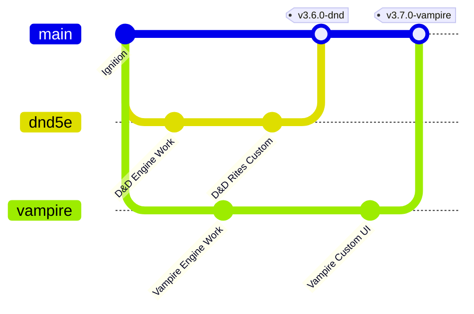

# 🔮 Fluxo Colaborativo & Emulação Local — Lyra the Wise WebApp

Este tomo místico documenta o fluxo de trabalho colaborativo, controle de branches no Git e configuração de emulação local do Firebase para o desenvolvimento seguro do **Lyra the Wise WebApp**.

---

## 🗺️ 1. Arquitetura de Branches (Git Flow)

Para garantir que o código em produção esteja sempre estável e harmonizado, dividimos o multiverso do projeto em branches dedicadas:



* **`main` (Produção):** Contém apenas versões consolidadas, testadas e prontas para o multiverso real. **NUNCA programe diretamente na main.**
* **`dnd5e` (Desenvolvimento):** Branch dedicada à evolução, ritos e testes de regras do motor de *D&D 5ª Edição*.
* **`vampire` (Desenvolvimento):** Branch dedicada à evolução e regras do motor de *Vampire: The Masquerade (V5)*.

### Comandos Úteis do Viajante:
```bash
# Sincronizar repositório local
git checkout main
git pull origin main

# Mudar para a branch de D&D 5e
git checkout dnd5e
git pull origin dnd5e

# Mudar para a branch de Vampire
git checkout vampire
git pull origin vampire
```

---

## ⚡ 2. Playground Local (Firebase Emulator Suite)

Para que todos trabalhem de forma independente nas branches de desenvolvimento **sem tocar no Firebase de Produção (nuvem)**, utilizamos o **Emulator Suite**. Ele replica o banco de dados (Firestore), a autenticação (Auth) e o armazenamento (Storage) localmente na sua máquina de forma rápida, isolada e 100% offline.

> [!CAUTION]
> **ATENÇÃO ÀS PORTAS DE COMUNICAÇÃO:**
> O servidor do frontend do Vite (rodado pelo `npm run dev-total`) utiliza a porta **`5173`**. 
> Se você tentar rodar algum emulador do Firebase (como o de Auth) na porta `5173`, haverá colisão e um dos dois serviços falhará em iniciar!
> Configuramos o arquivo `firebase.json` com portas limpas e consagradas para evitar conflitos.

### 🔌 Tabela de Portas do Multiverso Local:

| Serviço / Motor | Porta Local | Descrição |
| :--- | :---: | :--- |
| **Vite Frontend (SPA)** | `5173` | Onde você acessa a aplicação web (Vite dev server) |
| **Express Backend** | `8080` / `8082` | Servidor Node local que gerencia APIs secundárias |
| **Firebase Auth Emulator** | `9099` | Emulador de Contas e Login local (Offline) |
| **Firebase Firestore Emulator**| `8080` | Emulador do Banco de Dados local |
| **Firebase Storage Emulator** | `9199` | Emulador de Upload de Imagens/Tokens local |
| **Firebase Emulator Suite UI** | `4000` | **Painel Web de Controle** do Banco e Usuários locais |

---

## 🚀 3. Como Rodar o Playground Completo

Siga estes ritos de inicialização para programar localmente:

### Passo 1: Ligar os Emuladores do Firebase
No seu terminal do VS Code, inicie a emulação local offline:
```bash
firebase emulators:start
```
> [!TIP]
> Abra o navegador em `http://localhost:4000` para acessar o **Emulator Suite UI**. Lá você poderá criar contas de testes na aba *Authentication* e gerenciar os documentos e fichas livremente na aba *Firestore*, exatamente como no painel da nuvem!

### Passo 2: Ligar o Servidor de Desenvolvimento
Em outro terminal (deixe o emulador rodando no anterior), suba o front-end e o servidor NodeJS do app:
```bash
npm run dev-total
```
Acesse a aplicação em `http://localhost:5173`. 

---

## 🛡️ 4. Regras de Ouro da Governança

> [!IMPORTANT]
> **1. Conexão Automática de Emulação:**
> A aplicação em `js/auth.js` detecta automaticamente se você está em `localhost` e redireciona todas as chamadas do Firestore e do Auth para as portas do emulador local. Nenhum dado de teste ou credencial vazará para o Firebase real da nuvem.
>
> **2. Commits Limpos:**
> Nunca commite arquivos `.env` privados com chaves reais da nuvem. Use o `.env.example` como base.
> 
> **3. Evite Deploys Diretos:**
> O comando `firebase deploy` destina-se **exclusivamente** à branch `main` após homologação de PRs (Pull Requests). Nunca faça deploy a partir de branches de testes.

Que a harmonia das runas guie seu desenvolvimento! 🔮✨
