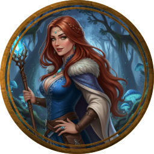

  

  

---

  🧙 <strong>Taverna Digital de RPG</strong> • 🔮 <strong>Oráculo Arcano</strong> • 📜 <strong>Pergaminhos Automáticos</strong> 
  🚀 <strong>Versão Alfa 3.4.0 (Separação dos Ecos)</strong> 

 <strong>Lyra the Wise</strong> não é apenas um app, é uma velha sábia que transformará seu navegador em uma <strong>mesa de RPG lendária</strong>. Ela tece histórias, calcula números e guia aventureiros novatos e veteranos.

  
  
  
  
  
  

> **Aviso do Escriba:** Os Ecos foram separados! O Oráculo Arcano agora possui uma mente dedicada (`prompts.js`), o combate foi refinado e a interface recebeu polimento visual em toda a extensão do Sanctum. Confira abaixo os recursos forjados.

---

## 🧭 **Mapa do Pergaminho**
- [✅ Conquistas (100% Funcional)](#conquistas)
- [🗺️ Roadmap Futuro](#roadmap)

---

O coração do sistema pulsa com magia plena. Os seguintes recursos estão completos e prontos para uso:

1.  **Criação de Fichas**: Editor completo e imersivo para personagens D&D 5e.
2.  **Criação e Uso de Itens**: Forja de itens personalizados e gestão de inventário integrada à ficha.
3.  **Grimórios de Magia**: Biblioteca arcana com busca inteligente e gestão de slots de magia.
4.  **Bestiário Completo**: Catálogo de monstros e criaturas com busca e criação manual/arcana.
5.  **Rolagem de Dados**: Simulador de dados 3D integrado ao fluxo do jogo.
6.  **Chat com os Heróis**: Interação direta com Lyra (Sábia), Damien (Mestre) e Eldrin (Bardo) para auxílio e narrativa imersiva.
7.  **Módulos de Conteúdo (Alfa)**: Novos módulos para mestres criarem Vilões, NPCs, Campanhas, Encontros, Puzzles, Tesouros, Cenas, Tramas, Motivações e Regras com auxílio do Oráculo Arcano.
8.  **Geração Global de Conteúdo**: Ferramentas integradas para mestres criarem NPCs, tramas e masmorras instantaneamente com o Oráculo.
9.  **Oracle AI Master System**: Assistente narrativo que provê imersão profunda, sugere rolagens de perícia e expande as cenas sob a coordenação do Mestre.
10. **Comunidade & Notificações**: Taverna social com sistema de alertas em tempo real para novas mensagens.
11. **Fluxo de Trabalho Dual-AI**: Sistema automatizado de desenvolvimento e auditoria (Builder/Auditor) para garantir máxima qualidade e segurança no código.

---

## 🗺️ **Roadmap Futuro**

As brumas escondem novas terras que em breve serão desbravadas:

1.  **Responsividade (Mobile)**: Adaptação dos pergaminhos para telas menores (celulares e tablets).
2.  **Sistema de Amigos & Convites**: Formação de grupos e gestão de amizades entre viajantes.

---
 

  

  <b>Forjado com ❤️ e Magia para a comunidade</b> 
  <em>Transformando navegadores em portais de aventura desde 2026</em>

