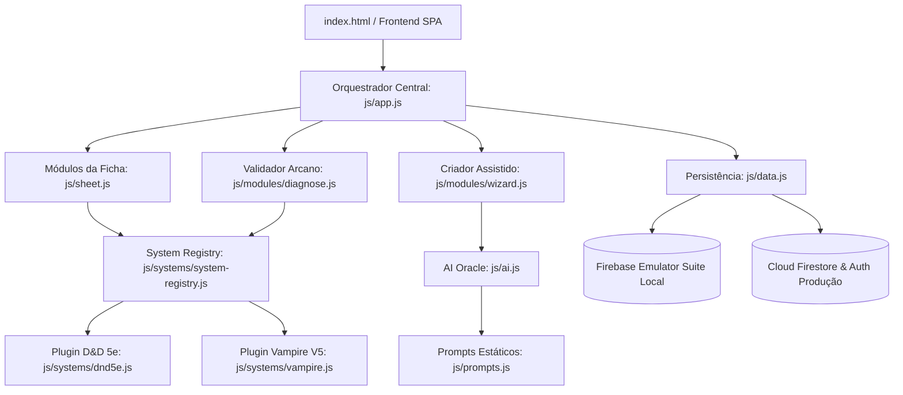

# 🔮 Lyra the Wise WebApp — Taverna Digital de RPG

<p align="center">
  
</p>

<p align="center">
  
</p>

---

<p align="center">
  🧙 <strong>Taverna Digital de RPG</strong> • 🔮 <strong>Oráculo Arcano</strong> • 📜 <strong>Pergaminhos Automáticos</strong><br>
  🚀 <strong>Versão Alfa 3.6.0 (Arquitetura Unificada e Ritos de Auditoria)</strong><br>
</p>

<p align="center">
  
  
  
  
  
  
</p>

---

## 📖 Sobre o Projeto

**Lyra the Wise** é uma plataforma imersiva e inteligente que transforma o navegador em uma verdadeira mesa de RPG lendária. O ecossistema é projetado com foco em alta flexibilidade (arquitetura modular multi-sistemas), cálculos automatizados precisos e IA de ponta para auxiliar narradores e jogadores a forjarem crônicas, NPCs, monstros e itens instantaneamente.

---

## 🛠️ Arquitetura do Sistema

O portal do Lyra utiliza uma arquitetura baseada em plugins isolados para dar suporte a múltiplos motores de jogo.



---

## 📂 Árvore de Diretórios (Folder Tree)

Abaixo está a estrutura de organização física e lógica de arquivos do repositório:

```
Lyra the Wise WebApp/
├── .agents/                    # Plugins e habilidades locais de IA
├── css/                        # Estilos globais e componentes visuais
│   ├── modules/                # CSS isolado de módulos (chat, combat, monsters)
│   ├── style.css               # Folha de estilo base unificada
│   └── themes.css              # Overrides dos temas (Lyra, Damien, Eldrin)
├── docs/                       # Documentação técnica do desenvolvedor
│   ├── firebase-colaborativo.md # Fluxo de branches no git e setup do Firebase
│   └── SISTEMAS.md             # Guia de criação de novos motores RPG (SystemPlugin)
├── js/                         # Lógica principal da aplicação
│   ├── core/                   # Scripts e bibliotecas estruturais de base
│   ├── data/                   # Adaptação e fontes de dados legadas
│   ├── modules/                # Funcionalidades e subsistemas da taverna
│   │   ├── admin.js            # Painel de controle do Mestre
│   │   ├── combat-engine.js    # Motor de combate e turnos
│   │   ├── diagnose.js         # Validador de integridade e Dry-run da Auditoria
│   │   ├── items.js            # Forja e gestão de inventário
│   │   ├── monsters.js         # Bestiário e invocação de monstros
│   │   ├── oracle.js           # Oráculo de IA integrado à narrativa
│   │   ├── spells.js           # Grimório e bibliotecas de feitiços
│   │   └── wizard.js           # Fluxo assistido de criação de fichas e campanhas
│   ├── systems/                # Motores de RPG (Plugins arcanos)
│   │   ├── dnd5e.js            # Motor de regras Dungeons & Dragons 5ª Edição
│   │   ├── vampire.js          # Motor de regras Vampire: The Masquerade (V5)
│   │   ├── system-interface.js # Contrato formal da API (SystemPlugin)
│   │   └── system-registry.js  # Registrador e carregador dinâmico de plugins
│   ├── ai.js                   # Camada de comunicação com APIs de IA (Gemini)
│   ├── app.js                  # Inicializador e roteador SPA do front-end
│   ├── auth.js                 # Camada de Autenticação do Firebase (Auth)
│   ├── data.js                 # Camada de Acesso a Dados do Firestore
│   └── prompts.js              # Estruturas e schemas JSON de prompts de IA
├── public/                     # Recursos estáticos servidos diretamente
│   ├── assets/                 # Mídias, portraits, mapas e tokens
│   └── index.html              # HTML estático de fallback
├── .env.example                # Molde de configuração de ambiente local
├── apphosting.yaml             # Configuração para Firebase App Hosting
├── audit.html                  # Painel de Auditoria de Banco de Dados
├── diagnose.html               # Painel de Auditoria de Sistemas RPG
├── firebase.json               # Configurações do Firebase CLI e portas dos emuladores
├── firestore.rules             # Regras rígidas de segurança do banco de dados
├── index.html                  # Ponto de entrada do SPA
├── server.js                   # Servidor NodeJS de desenvolvimento local
└── vite.config.mjs             # Configuração de bundler do Vite
```

---

## 📱 **Ecossistema Mobile — O Futuro em Flutter**

Para estender a magia do portal a todos os dispositivos móveis, o futuro aplicativo móvel da **Lyra the Wise** será forjado utilizando o framework **Flutter**.

### 🌟 Vantagens da Escolha do Flutter:
*   **Base de Código Única (Dart):** Renderização nativa de alta performance tanto para **Android** quanto para **iOS**, reduzindo custos de manutenção e acelerando o deploy de novos recursos em paralelo.
*   **Interface Fluida e Imersiva:** O Flutter renderiza seus próprios componentes diretamente na tela do dispositivo (via Skia/Impeller), o que nos permitirá transpor a rica identidade estética medieval da web (gradientes suaves, micro-animações, pergaminhos) com taxa de atualização constante a 60/120 FPS.
*   **Portabilidade de Motores:** A arquitetura desacoplada de plugins (`SystemPlugin`) criada no front-end web facilitará a migração da lógica de regras (fichas, cálculos de atributos, dados derivados) para pacotes em Dart, alimentando a sincronização local em tempo real fornecida pelo SDK nativo do Cloud Firestore.

---

## 🗺️ **Roadmap Futuro**

As brumas escondem novos horizontes que em breve serão desbravados:

1.  **Sistema de Amigos:** Adicionar laços entre aventureiros no portal, permitindo buscar e gerenciar listas de amigos no multiverso.
2.  **Grupos de Chat:** Criação de salas e chats integrados para que grupos de jogadores e mestres possam planejar suas jornadas e rolar dados juntos em tempo real.

---

<p align="center">
  <a href="https://ko-fi.com/leosdc" target="_blank">
    
  </a>
</p>

<p align="center">
  <b>Forjado com ❤️ e Magia para a comunidade de RPG</b><br>
  <em>Transformando navegadores em portais de aventura desde 2026</em>
</p>
